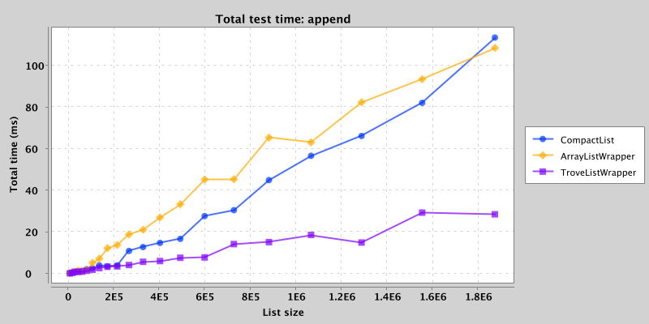
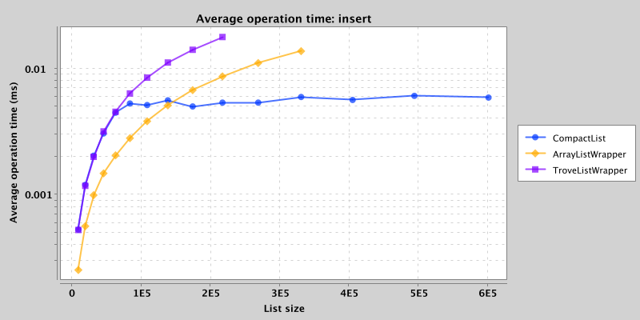
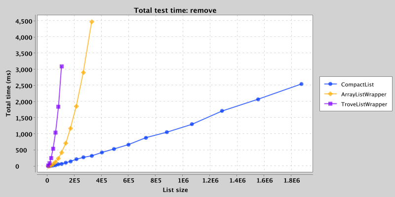
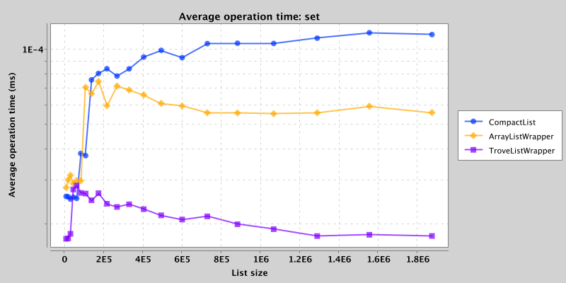
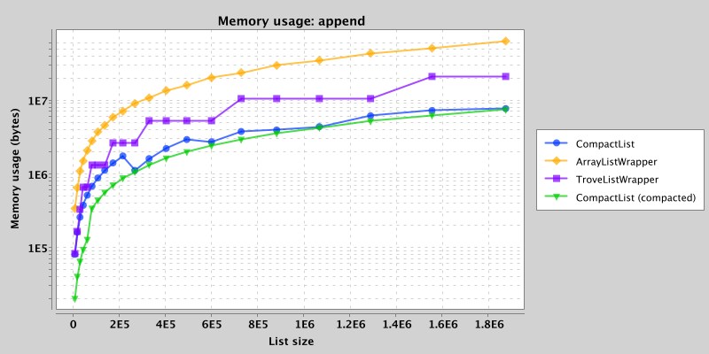
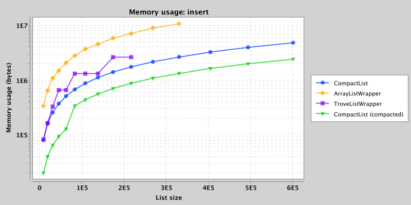
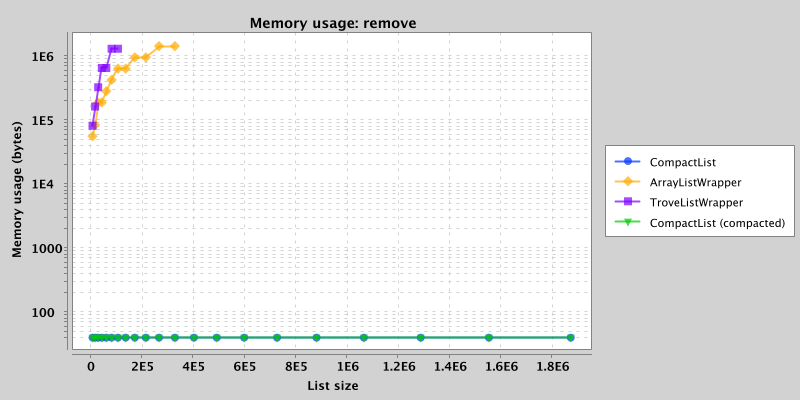
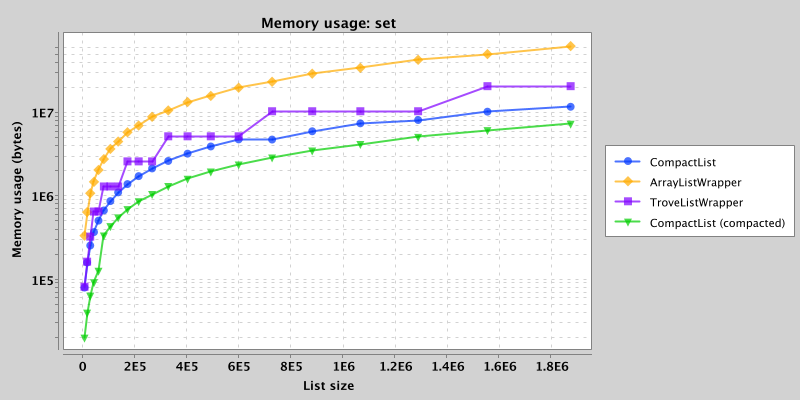

# CompactList

[](https://travis-ci.org/kothar/compactlist)

CompactList implements the `List<Long>` interface, but internally it uses a tree of variable word-width segments to improve
performance and memory usage compared to an `ArrayList`.

Similar primitive container implementations can be found elsewhere, notably:

  * [Trove][1]
  * [Guava Primitive Wrappers][2]
  
[1]: https://bitbucket.org/trove4j/trove
[2]: https://google.github.io/guava/releases/19.0/api/docs/com/google/common/primitives/Ints.html#asList(int...)

## Maven

This project is published to Maven Central via Sonatype OSSRH

```
<dependency>
  <groupId>net.kothar</groupId>
  <artifactId>compactlist</artifactId>
  <version>0.1.0</version>
</dependency>
```

## Performance

Performance of `CompactList` tends to be worse than `ArrayList` for small lists, but gains an advantage 
for random inserts as list size increases. This is mainly due to the tree structure which limits the
amount of memory that needs to be copied when elements are inserted or removed, or the allocated backing 
array is grown during an append.

The implementation currently splits segments at 2^16 elements, which is where performance gains for insertion start to appear.
In the charts below, `CompactList` beats `ArrayList` when inserting ~2^17 or more elements.

Benchmarks were run on a 2.2 GHz Intel Core i7 running MacOS 10.13.2 and Oracle Java 1.8.0_131-b11

`mvn exec:exec` will run the benchmarks.
 
### Append
This benchmark appends sequential values to the end of the list.




### Insert
This benchmark inserts sequential values at random locations as the list grows




### Remove
This benchmark creates a list of sequential values by appending, then removes
elements at random indices until the list is empty.




### Set
This benchmark creates a list of sequential values by appending, then sets
elements at random indices a number of times equal to the size of the list.




### Iteration

## Memory usage

Memory usage depends on how regular the data is, since more regular data can be stored with fewer bits. As a baseline,
non-compacted `CompactLists` on a 64-bit JVM use roughly one third of the memory of an `ArrayList<Long>`
(8 bytes per value vs 4 byte pointer + 24 byte Long object per value). Memory usage after compaction
is close to the underlying storage size for the smallest word width capable of storing the range of values in each segment.

`CompactList` handles regular data such as repeated or ascending values extremely well.

Storage strategies are implemented for word widths of 64, 32, 16, 8, 4 and 0 (constant value).






## Compaction strategy

Lists can be compacted manually by calling `CompactList.compact()`.

When compacting, several strategies are attempted to reduce the storage size needed:

**Linear Prediction** will only record the distance of each point in a segment from a trend line of the form *ax + b*.

**Offset** will attempt to add an offset to each value, shifting the zero-point to the mean value in that segment. It has
an advantage over the linear prediction strategy in that it is *position independent* and inserting or removing values
from a segment will not change the validity of other entries.
